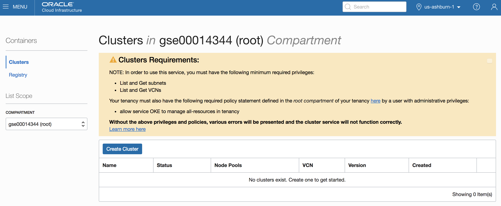
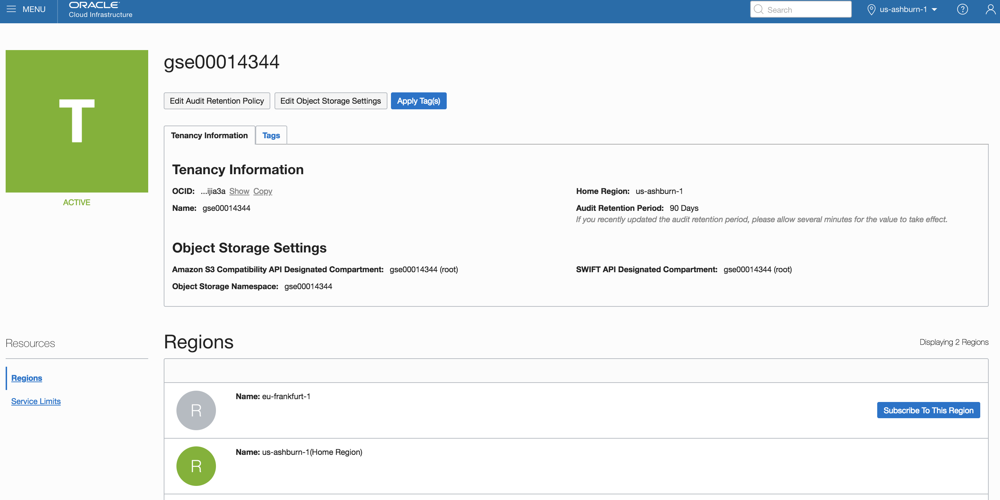
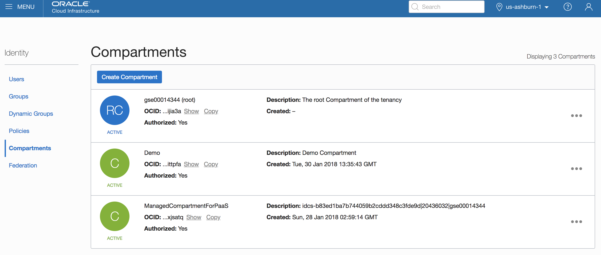
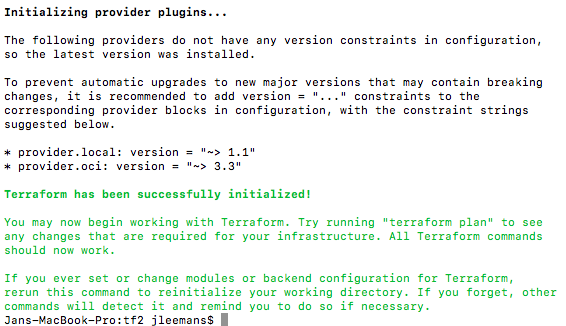

# Spin up a Managed Kubernetes cluster with all required networking objects #

## Introduction

This page describes how to instantiate an **Oracle Managed Kubernetes cluster using Terraform**, including all the required network elements such as VNC's, subnets and access lists.

If you are familiar with Terraform and Oracle OCI, you can simply perform following steps:

- Clone this repository locally
- Make sure you have created a non-SSO user with an API certificate, and created a new policy with a  `allow service OKE to manage all-resources in tenancy` statement
- Edit the file terraform.tfvars and enter your instance OCID's on the first lines
- run ```terraform init``` , `terraform plan` and `terraform apply` to spin up your infrastructure
- validate the resulting K8S infrastructure via `kubectl`, using the file **mykubeconfig** that was created 


In the remainder of this page, you find a more detailed description of these steps, with screendumps and explanations where to find the various OCID's and how to install the required commands `terraform` and `kubectl` on your local machine.


## Setting up your environment to use OKE ##

- You need to have an OCI account that has the OKE service available.  To validate this, navigate to the OCI console, and select the menu item "Developer Services, "Container Clusters". 

  

- Add a policy statement on the level of the root compartment
  - Navigate to the "Identity" , "Policies" screen and hit the "Create Policy" button
  - Choose a name for the policy, and define it with the below text:
    - "allow service OKE to manage all-resources in tenancy"

  

- Add an API (non-SSO) user with an API key:
  - Navigate to the "Identity" , "Users" screen and add a user called "api.user"
  - Add an API key: you need a private/public key pair, and you need to paste the public one into the key field. 

    - On a Mac : open a console window and execute following commands

    - ```
      mkdir ./mykey
      openssl genrsa -out ./mykey/api_key.pem 2048
      openssl rsa -pubout -in ./mykey/api_key.pem -out ./mykey/api_key_public.pem
      ```

    - On a Windows PC, you can use [puttygen](https://www.ssh.com/ssh/putty/download).exe to create a key.
  - Copy the fingerprint of your API key in a temporary file
  - Copy the OCID of this new user in a tempporary file


  

- Terraform needs to be installed on your local machine.  
    - Go to the [Hashicorp Terraform website](https://www.terraform.io/downloads.html) to download the software for your OS
    - unzip the executable file in the directory of your choice
    - Add the terraform command to your path
        - On Mac: export PATH=$PATH:`pwd`
        - On Windows: go to System Steetings, Advanced, Environment Variables, and add the path to your Terraform directory 


## Info required to enable the script for your environment: ##

You need to collect a series of OCID's from your instance in order for Terraform to access your instance:
- Tenancy OCID
- Region name
- Compartiment OCID
- User OCID
- API Key fingerprint
- Private key API local path


Screen shots of the various locations to find this information

- **Tenancy OCID** and **Region Name**:
  - Navigate to "Administration", "Tenancy Details"
  
  
- **Compartment OCID**
  - Navigate to "Identity", "Compartments"
  - Select the compartment where you want to create the cluser (for example "Demo")
  
  
- **User OCID** and **API Key Fingerprint**
  - Navigate to "Identity", "Users"
  - Select the user you created
  
  
- **Private Key API Path**
  - This is the local path on your laptop where the private key file is located


## Steps to execute ##

- Clone this git repository locally on your machine

- Edit the file terraform.tfvars and enter your instance OCID's on the first lines, using the information collected in the previous section

- In case you do not have terraform installed on your machine, follow these steps:

   - Download the appropriate Terraform package for your operating system from the [terraform.io downloads page](https://www.terraform.io/downloads.html).
   - **Unzip** the file you downloaded into the folder ~/terraform. You can use the command line or a graphical zip program for this operation. 
   - Add Terraform to your PATH in the **terminal window**  using the following command:

   ```bash
   export PATH=$PATH:`pwd`
   ```

- run `terraform init` in this directory, all dependencies, including oci v3 should download

- 

- run `terraform plan` to validate your config

   - You should see 13 objects to be created

   - 

- run `terraform apply` to spin up your infrastructure

   - 

   - type "yes"

- In case you do not have kubectl installed on your machine, follow these steps:

   - [Instructions to Install kubectl](kubectl_install.md)

- validate the resulting K8S infrastructure :

   - export KUBECONFIG=./mykubeconfig
   - kubectl version
   - kubectl get nodes

   To access the Kubernetes console:
   - kubectl proxy
   - Then navigate to   
   http://localhost:8001/api/v1/namespaces/kube-system/services/https:kubernetes-dashboard:/proxy/#!/login


## Improvement plans ##
- creation of OKE dedicated compartment
- add nginx ingress 
