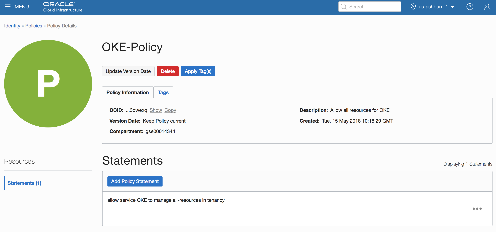

# Spin up a Managed Kubernetes cluster with all required networking objects #

## Prerequisites: ##

- You need to have an OCI account that has the OKE service available.  To validate this, navigate to the OCI console, and select the menu item "Developer Services, "Container Clusters". 

  
  
- Add a policy statement on the level of the root compartment
  - Navigate to the "Identity" , "Policies" screen and hit the "Create Policy" button
  - Choose a name for the policy, and define it with the below text:
    - "allow service OKE to manage all-resources in tenancy"
  
  
  
- Add an API (non-SSO) user with an API key:
  - Navigate to the "Identity" , "Users" screen and add a user called "api.user"
  - Add an API key and a Auth Token, and take care to carefully note down the token, you will need it later.
  
  
  
- Terraform needs to be installed on your local machine.  
    - Go to the [Hashicorp Terraform website](https://www.terraform.io/downloads.html) to download the software for your OS
    - unzip the executable file in the directory of your choice
    - Add the terraform command to your path
        - On Mac: export PATH=$PATH:`pwd`
        - On Windows: go to System Steetings, Advanced, Environment Variables, and add the path to your Terraform directory 

## Info required to enable the script for your environment: ##
- Tenancy OCID
- Compartiment OCID
- User OCID
- API Key fingerprint
- Private key API local path
- Region name

## Steps to execute ##

- Clone this repository locally
- Edit the file terraform.tfvars and enter your instance OCID's on the first lines
- run terraform init in this directory, all dependencies, including oci v3 should download
- run terraform plan to validate your config
- run terraform apply to spin up your infrastructure
- validate the resulting K8S infrastructure :
   - export KUBECONFIG=./mykubeconfig
   - kubeconfig version

## Improvement plans ##
- creation of OKE dedicated compartment
- add nginx ingress 
